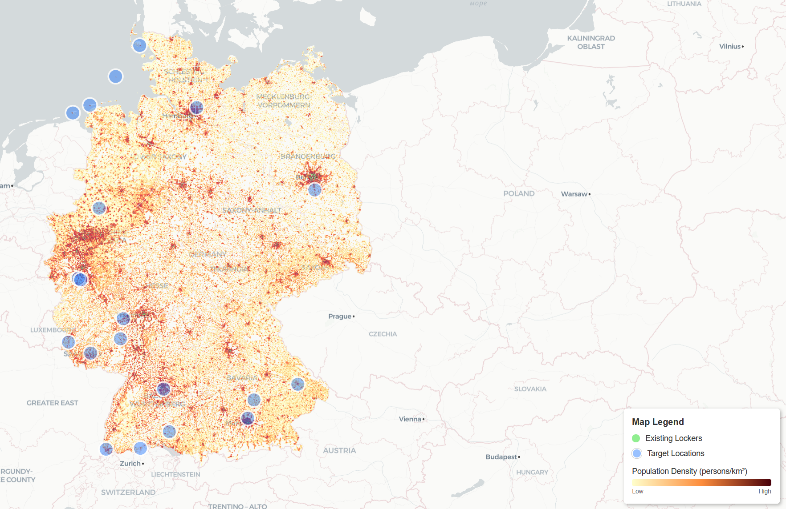
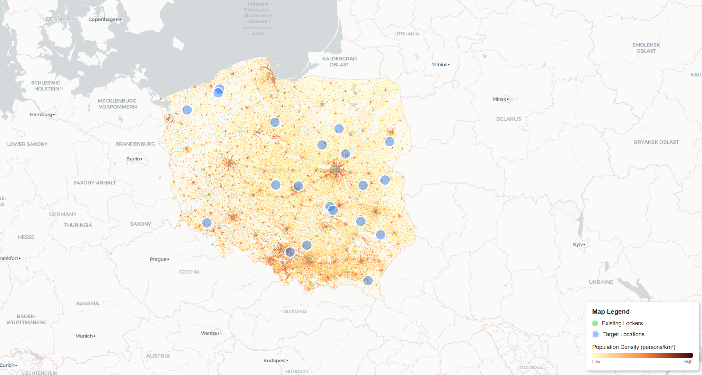
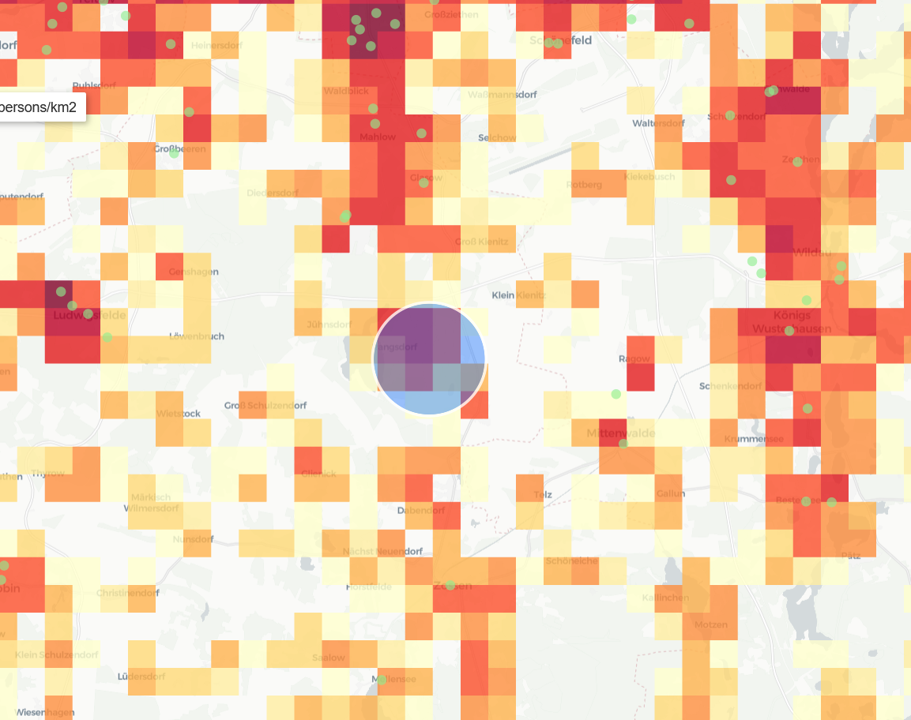
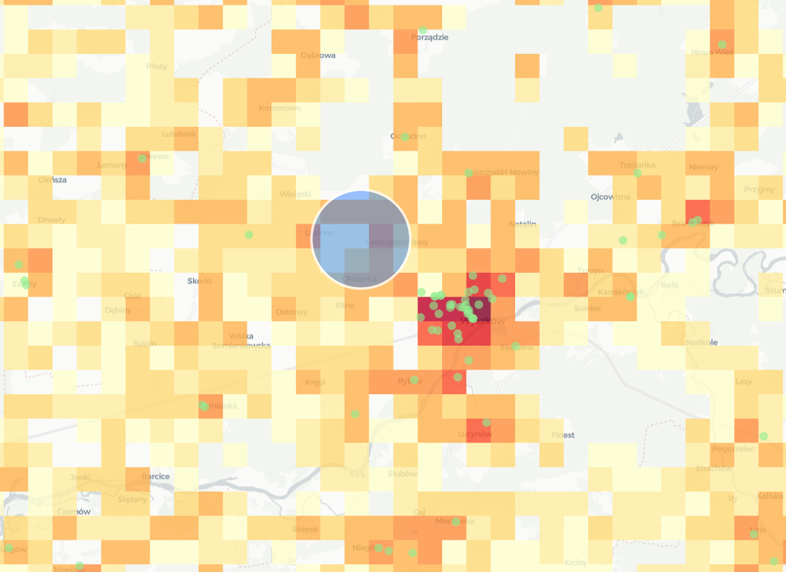
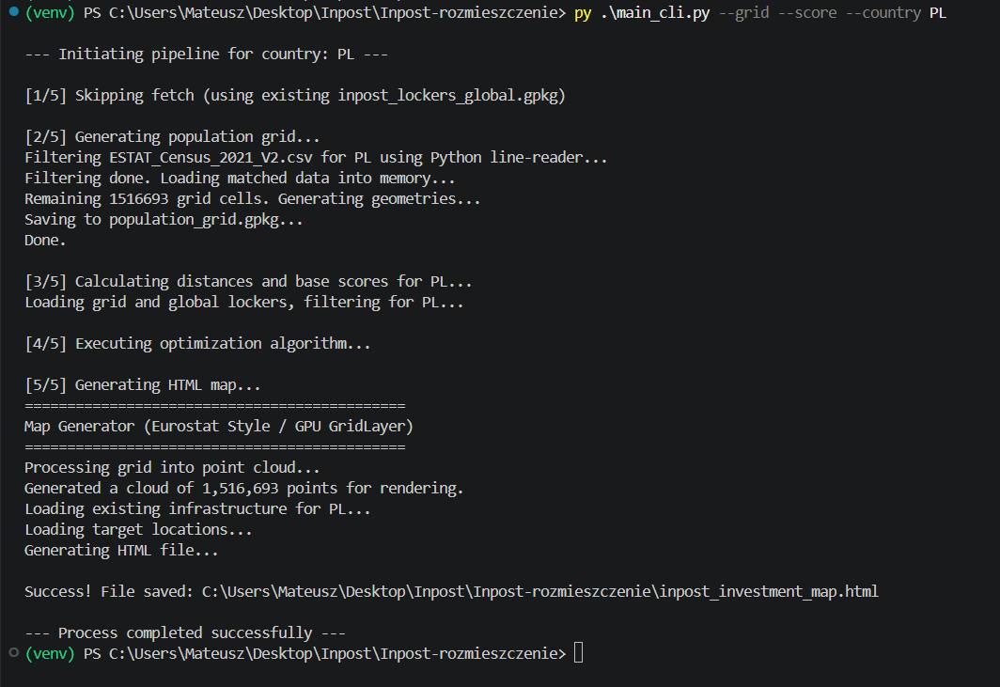

# Inpost Locker Spot Finder

## Author

- **Name:** Mateusz Kowalczuk 
- **Email:** kowalczuk.mateusz010@gmail.com

## Overview

I've built python cli tool that finds places where new lockers could be built. It uses a population density grid from eurostat to find places of high population density and no lockers near.

## Demo & Description

My solution uses the provided API to take locations of built lockers and also uses a population grid (https://gisco-services.ec.europa.eu/census/2021/Eurostat_Census-GRID_2021_V2.2.zip). The population grid is in 1x1 km resolution, so for each square i calculate a score using formula population*distance from nearest locker in km.
After that, for each square I generate a circle of a given radius that calculates the sum of the scores in that area so that I have a more usefull dataset - a group of squares eliminates exceptions.
In cli you are able to play around with parameters of the algorithm - the radius of a circle, how many top scores, and the minimum distance between 2 new lockers. 
After that I get top scores from these calculations and display them on a map, to visualise it better and help make buisness decisions.
I was inspired by the map available at (https://ec.europa.eu/eurostat/web/gisco/geodata/population-distribution/population-grids)

Here are some outputs:







## Technologies

This project relies heavily on spatial data libraries. The main focus was keeping memory usage low while processing millions of grid cells.

* **Pandas & GeoPandas**: The main data crunchers. Pandas streams the massive Eurostat census files so it doesn't nuke your RAM. GeoPandas handles all the spatial joins and coordinate system conversions (like translating GPS to flat EPSG:3035 grids).
* **Scikit-learn & SciPy**: The optimization engine. Using `radius_neighbors_graph` and `cKDTree` lets the script calculate neighborhood scores across millions of points instantly using sparse matrices, avoiding slow Python `for` loops.
* **Shapely**: Builds the actual 1x1 km polygons out of the raw Eurostat grid IDs.
* **Requests**: Pulls the live locker coordinates from the InPost REST API and handles pagination.
* **Pydeck**: Generates the final interactive HTML map. Standard web maps choke on this much data, so Pydeck offloads the rendering to the GPU (WebGL) to keep the browser from freezing.
* **Folium & Matplotlib**: Used for quick debugging and basic plots during development.

## How to run
1. Clone the repository
2. Download and unzip this file in the same folder https://gisco-services.ec.europa.eu/census/2021/Eurostat_Census-GRID_2021_V2.2.zip 
3. Run inside virtual python environment
4. download all libraries in requirements.txt
5. run the main_cli.py, with the -h flag for instructions how to use it

### Prerequisites

* **Python 3.12+** (Tested on 3.12).
* **Eurostat Census Data:** The `ESTAT_Census_2021_V2.csv` file must be placed in the project root to generate population grids.
* **OS:** Windows, macOS, or Linux (WSL supported).
* **Hardware:** Minimum 8GB RAM recommended (the Eurostat parsing is optimized for memory, but spatial joins still require decent memory).

### Build & run

[Step-by-step instructions to get your solution running from a clean clone of the repository. Be specific — commands, not just descriptions.]

#### Linux / macOS
```bash
# 1. Clone the repository
git clone [https://github.com/Ptakun123/Inpost-rozmieszczenie.git](https://github.com/Ptakun123/Inpost-rozmieszczenie.git)
cd Inpost-rozmieszczenie

# 2. Create and activate a virtual environment
python3 -m venv venv
source venv/bin/activate

# 3. Install dependencies
pip install -r requirements.txt

# 4. View available arguments and help
python3 cli.py --help 

# 5. Example: Initial full run for Poland
python3 cli.py --fetch --grid --score --country PL
```

Windows:
# 1. Clone the repository
git clone [https://github.com/Ptakun123/Inpost-rozmieszczenie.git](https://github.com/Ptakun123/Inpost-rozmieszczenie.git)
cd Inpost-rozmieszczenie

# 2. Create and activate a virtual environment
python -m venv venv
.\venv\Scripts\activate

# 3. Install dependencies
pip install -r requirements.txt

# 4. View available arguments and help
python cli.py --help 

# 5. Example: Initial full run for Poland
python cli.py --fetch --grid --score --country PL


Note: For the first execution for any given country, you must include the --fetch, --grid, and --score flags to generate the initial database files.

## What I would do with more time

I would want to test it better with some more edge cases, also it is sometimes slow so maybe add some optimizations.
Also I could use a more interesting map - maybe an isochrone map and also a more sophisticated algorithm
 


## AI usage

I used Gemini for this project. It saved me a lot of time and I would not have done this project in this amount of time without it. I use it mostly to research the libraries that are usefull for the projects I do - it saves a lot of time in research. I also used it for some code generation, testing, bug fixing, although it made some mistakes I had to personally fix. I read every line it produces so that I have an understanding of what my code does. I also used it a lot for refractoring my code as my python code isn't always the best written.

[Did you use AI tools (ChatGPT, Copilot, Claude, etc.) while working on this? If yes, describe how — which parts did they help with, and how did you verify and adapt their output?]

## Anything else?

I was suprized how often WSL was crashing due to ram usage, also some countries are failing to load the map because of .html file beeing too large
